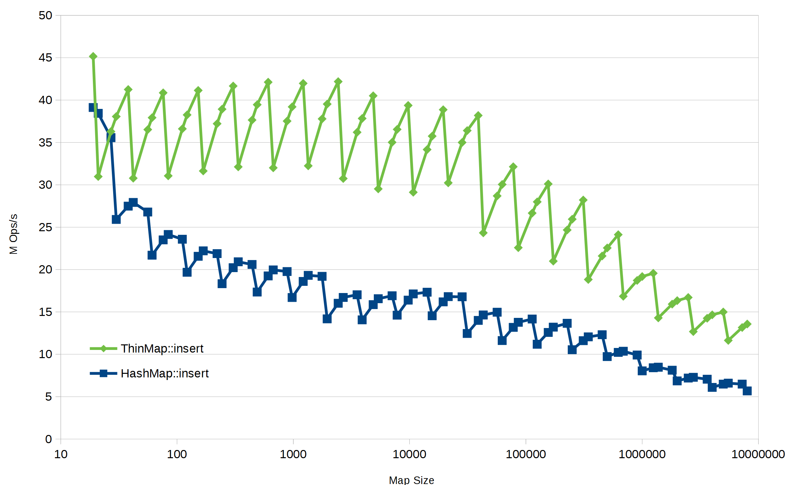
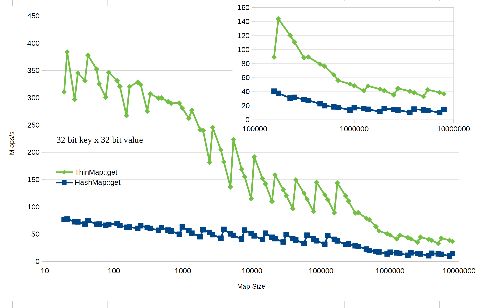
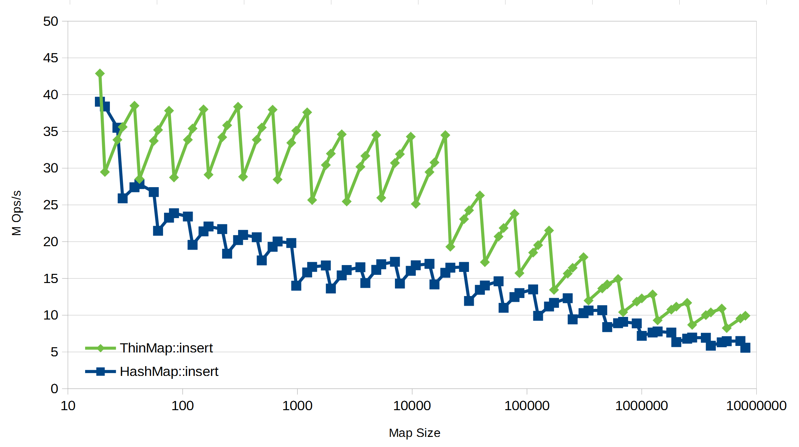
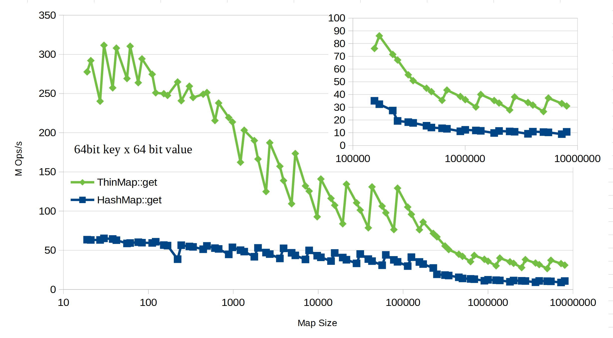
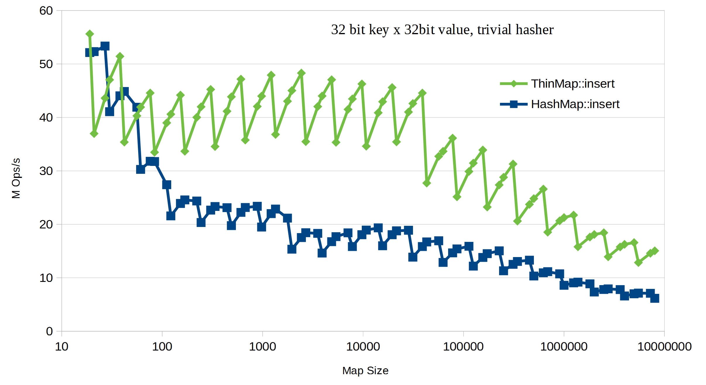
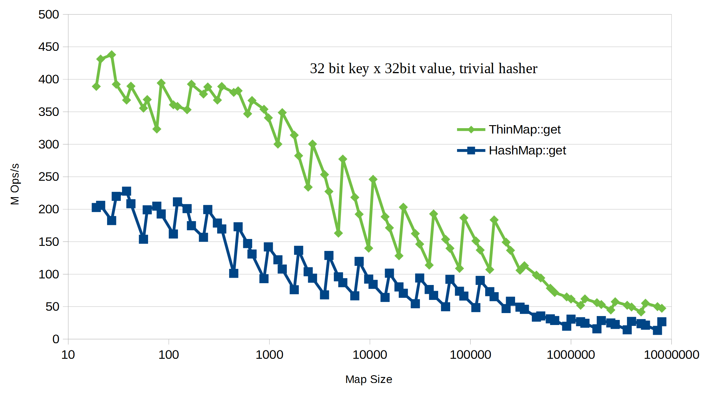
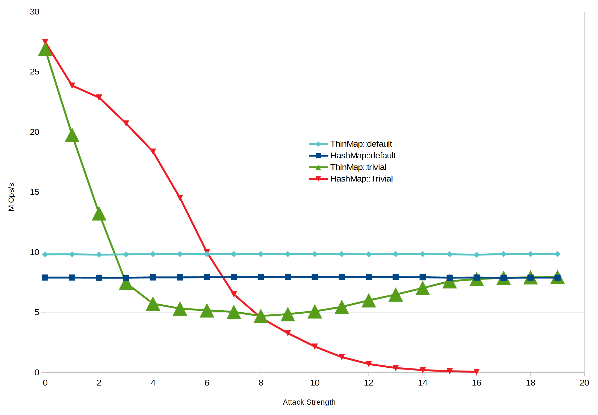

# Benchmark Setup

The benchmarks can be found in the `benches` folder. The following results were executed on
an Intel i7-7700K with 16GB RAM, under Windows 10 with Rust nightly (around rustc 1.30). Unfortunately,
the rust benchmark feature is still unstable, so nightly is the only choice. No special compiler flags
were used (to be fair to the `std` impl).

We've measured insert and get performance for both `ThinMap` and `HashMap`.

Running the benchmarks takes a long time, so it you're going
to run them yourself, either run them overnight or run just one or two of them.

# Benchmark Results
The raw results can be found in `benchm.results.txt` and the spreadsheet to produce the graphs is
`map-results.ods`.

## 32 bit x 32 bit Insert `(K,V) = (i32, u32)`

The maps are initialized using `::new()`, so using all the defaults.

We generate a random vector and insert N values into the map. N is the X axis in the graph.
The Y axis is million operations per second. Note the logarithmic X axis.

The zig-zag in the performance is typical of all map implementation and happens because of
the amortized resizing algorithm.

## 32 bit x 32 bit get

The maps are initialized using `::new()`, so using all the defaults. We then insert N random keys
into the map. We then shuffle the keys and call get. Obviously, the order of the inserts and get are
different. Only the get call time is measured.

## 64 bit x 64 bit Insert `(K,V) = (i64, u64)`

Same as above, but with 64 bit K,V.

## 64 bit x 64 bit get

Same as above, but with 64 bit K,V.

## Trivial Hasher
It's interesting to tease out the difference in performance caused by the `Hasher` implementation
versus the structural differences in the two map implementation. Here, we use the same trivial (pass-through)
hasher for both maps. `ThinMap` maintains a smaller, but significant lead.

## 32 bit x 32 bit insert, trivial hasher

The maps are initialized using `::with_hasher(TrivialOneFieldHasherBuilder::new())`
We generate a random vector and insert N values into the map.

## 32 bit x 32 bit get, trivial hasher

The maps are initialized using `::with_hasher(TrivialOneFieldHasherBuilder::new())`. We then insert N random keys
into the map. We then shuffle the keys and call get. Obviously, the order of the inserts and get are
different. Only the get call time is measured.

## 64 bit x 64 bit insert, Attack pattern

Using a trivial hasher with `HashMap` is not well advised because `HashMap` uses a simple linear collision resolution,
which can be attacked if the hash values are predictable. `ThinMap`, however, uses a non-linear adaptive collision resolution
algorithm that's both fast and resilient.

For this benchmark, we're using 1.5 millions elements and measuring insert time. We use sequential numbers that are shifted
by the "Attack Strength" (X-axis). So with attack strength zero, we're just inserting (0, 1, 2, 3, ..., 1.5M - 1). At attack
strength 1, we're inserting (0, 2, 4, 6, ...), and so on.

Neither `ThinMap` nor `HashMap` have any trouble if we use their default hashers. But if we use a trivial hasher, `HashMap`
keeps becoming worse with attack strength to the point that the benchmark didn't finish overnight after 16. In other
words, the map is no longer `O(1)`. `ThinMap`,
however, with it's non-linear adaptive collision resolution stabilizes, remaining `O(1)`.

